# LogiTrack — Sistema de Otimização de Rotas e Entregas
### Mini Projeto Arquiteto Decisor · Fase 3 — Cloud & Microsserviços
**Arquitetura de Software 2026.1 · UniEVANGÉLICA · Prof. Carlos Roberto Gomes Júnior**

---

## Visão Executiva

O **LogiTrack** é um sistema de otimização de rotas e entregas desenvolvido para empresas de logística que precisam modernizar suas operações com rastreamento em tempo real, gerenciamento de frota e previsão de chegada. O sistema resolve três dores críticas do negócio:

1. **Ineficiência de rota** — motoristas percorrem caminhos subótimos sem considerar tráfego e janelas de entrega em tempo real.
2. **Falta de visibilidade** — clientes e gestores não têm acesso ao status preciso das entregas.
3. **Fragilidade operacional** — sistemas monolíticos legados não toleram picos de volume nem falhas de APIs externas (mapas, ERP).

**Estado atual na Fase 3:** A arquitetura evoluiu do modelo N-Tier refatorado na Fase 1 e do ADR hexagonal documentado na Fase 2 para uma **arquitetura de microsserviços distribuída em Google Cloud Platform (GCP)**, com containerização via Cloud Run, orquestração Kubernetes (GKE) para serviços stateful, comunicação assíncrona via Pub/Sub e observabilidade centralizada.

---

## Diagrama C4 — Nível 2: Containers

```mermaid
C4Container
    title LogiTrack — Diagrama de Containers (Fase 3 / GCP)

    Person(motorista, "Motorista", "Usa o app mobile para receber rotas e confirmar entregas")
    Person(gestor, "Gestor de Frota", "Monitora entregas, veículos e KPIs via dashboard web")
    Person(cliente, "Cliente Final", "Acompanha status da entrega via link público")

    System_Ext(googlemaps, "Google Maps Platform", "API de geocodificação, rotas e tráfego em tempo real")
    System_Ext(erp, "ERP Externo", "Sistema de gestão de estoque e pedidos")

    System_Boundary(logitrack, "LogiTrack — GCP") {

        Container(apigw, "API Gateway", "Cloud Endpoints / Kong", "Ponto único de entrada; autenticação JWT, rate limiting, roteamento por versão")

        Container(svc_rotas, "Serviço de Rotas", "Python / Cloud Run", "Calcula e otimiza rotas usando algoritmo OR-Tools; consome Google Maps API")
        Container(svc_frota, "Serviço de Frota", "Node.js / Cloud Run", "CRUD de veículos, motoristas e alocação de carga")
        Container(svc_entregas, "Serviço de Entregas", "Java / Cloud Run", "Ciclo de vida das entregas: criação, status, confirmação, histórico")
        Container(svc_rastreio, "Serviço de Rastreio", "Go / GKE", "Ingesta posições GPS em tempo real via WebSocket; stateful, alta frequência")
        Container(svc_notif, "Serviço de Notificações", "Node.js / Cloud Run", "Envia SMS/e-mail/push ao cliente e gestor em eventos de entrega")

        ContainerDb(db_rotas, "DB Rotas", "Cloud SQL (PostgreSQL)", "Histórico de rotas calculadas e métricas de otimização")
        ContainerDb(db_frota, "DB Frota", "Cloud SQL (PostgreSQL)", "Cadastro de veículos e motoristas")
        ContainerDb(db_entregas, "DB Entregas", "Cloud SQL (PostgreSQL)", "Pedidos, status e histórico de entregas")
        ContainerDb(db_rastreio, "DB Rastreio", "Firestore", "Posições GPS em tempo real — NoSQL para alta escrita")

        Container(pubsub, "Pub/Sub", "Google Cloud Pub/Sub", "Barramento de eventos assíncronos entre microsserviços")
        Container(redis, "Cache / Session Store", "Memorystore (Redis)", "Cache de rotas recentes e blocklist de JTI para revogação de tokens")

        Container(frontend, "Dashboard Web", "React / Cloud Run", "Interface do gestor de frota — SPA servida via CDN")
        Container(app_mobile, "App Mobile", "Flutter", "Aplicativo do motorista — recebe rota e confirma entregas")
    }

    Rel(motorista, app_mobile, "Usa", "HTTPS")
    Rel(gestor, frontend, "Acessa", "HTTPS")
    Rel(cliente, apigw, "Consulta status", "HTTPS")

    Rel(app_mobile, apigw, "Requisições REST", "HTTPS / JWT")
    Rel(frontend, apigw, "Requisições REST", "HTTPS / JWT")

    Rel(apigw, svc_rotas, "Roteia", "HTTP/2")
    Rel(apigw, svc_frota, "Roteia", "HTTP/2")
    Rel(apigw, svc_entregas, "Roteia", "HTTP/2")
    Rel(apigw, svc_rastreio, "Roteia WebSocket", "WSS")

    Rel(svc_rotas, googlemaps, "Consulta rotas e tráfego", "HTTPS")
    Rel(svc_rotas, db_rotas, "Lê/Escreve", "TCP")
    Rel(svc_rotas, redis, "Cache de rotas", "TCP")

    Rel(svc_frota, db_frota, "Lê/Escreve", "TCP")
    Rel(svc_entregas, db_entregas, "Lê/Escreve", "TCP")
    Rel(svc_rastreio, db_rastreio, "Escreve posições", "gRPC")

    Rel(svc_entregas, pubsub, "Publica EntregaAtualizada", "async")
    Rel(svc_rastreio, pubsub, "Publica PosicaoAtualizada", "async")
    Rel(pubsub, svc_notif, "Consome eventos", "async")
    Rel(pubsub, svc_rotas, "Consome PosicaoAtualizada", "async")

    Rel(svc_entregas, erp, "Sincroniza pedidos", "REST/HTTPS")
    Rel(redis, apigw, "Blocklist JWT", "TCP")
```



---

## ADRs — Decisões Arquiteturais

| # | Decisão | Status | Link |
|---|---------|--------|------|
| 0001 | Estratégia de Nuvem e Escalabilidade (GCP Cloud Run + GKE) | Aceita | [docs/adrs/0001-estrategia-nuvem.md](docs/adrs/0001-estrategia-nuvem.md) |
| 0002 | Padrões de Resiliência (API Gateway + Circuit Breaker + Bulkhead) | Aceita | [docs/adrs/0002-padrao-resiliencia.md](docs/adrs/0002-padrao-resiliencia.md) |
| 0003 | Modelo de Comunicação (Síncrono REST + Assíncrono Pub/Sub) | Aceita | [docs/adrs/0003-modelo-comunicacao.md](docs/adrs/0003-modelo-comunicacao.md) |

---

## SAD — Software Architecture Document

Documentação completa da arquitetura da Fase 3 disponível em:  
→ [docs/sad/sad-fase3.md](docs/sad/sad-fase3.md)

---

## Como Executar o Projeto Localmente

### Pré-requisitos

- Docker ≥ 24.x e Docker Compose ≥ 2.x
- Node.js ≥ 20.x (para o dashboard)
- Python ≥ 3.11 (para o serviço de rotas)
- Java 21 (para o serviço de entregas)

### 1. Clone o repositório

```bash
git clone https://github.com/SEU_USUARIO/logitrack-fase3.git
cd logitrack-fase3
```

### 2. Configure as variáveis de ambiente

```bash
cp src/.env.example src/.env
# Edite o .env com sua GOOGLE_MAPS_API_KEY e demais configurações
```

### 3. Suba o ambiente com Docker Compose

```bash
cd src
docker compose up --build
```

### 4. Acesse os serviços

| Serviço | URL local |
|---------|-----------|
| API Gateway | http://localhost:8000 |
| Dashboard Web | http://localhost:3000 |
| Serviço de Rotas | http://localhost:8001 |
| Serviço de Entregas | http://localhost:8002 |
| Serviço de Frota | http://localhost:8003 |
| Keycloak (Auth) | http://localhost:8080 |

### 5. Executar testes

```bash
# Rotas
cd src/svc-rotas && pytest

# Entregas
cd src/svc-entregas && ./mvnw test

# Frota
cd src/svc-frota && npm test
```

---

## Estrutura do Repositório

```
logitrack-fase3/
├── src/                        # Código-fonte dos microsserviços
│   ├── svc-rotas/              # Python / OR-Tools
│   ├── svc-frota/              # Node.js
│   ├── svc-entregas/           # Java / Spring Boot
│   ├── svc-rastreio/           # Go
│   ├── svc-notificacoes/       # Node.js
│   ├── frontend/               # React
│   └── docker-compose.yml
├── docs/
│   ├── adrs/                   # Architecture Decision Records
│   ├── sad/                    # Software Architecture Document
│   └── diagrams/               # Diagramas complementares
├── gold-plating/               # Artefatos extras (bônus)
├── README.md
└── .gitignore
```

---

## Referências

- MARTIN, Robert C. *Clean Architecture: A Craftsman's Guide to Software Structure and Design*. Prentice Hall, 2017.
- NEWMAN, Sam. *Building Microservices: Designing Fine-Grained Systems*. 2ª ed. O'Reilly, 2021.
- PRESSMAN, Roger S. *Engenharia de Software: Uma Abordagem Profissional*. 7ª ed. McGraw-Hill, 2011.
- NYGARD, Michael T. *Release It! Design and Deploy Production-Ready Software*. 2ª ed. Pragmatic Bookshelf, 2018.
- Google Cloud Architecture Framework. Disponível em: https://cloud.google.com/architecture/framework
